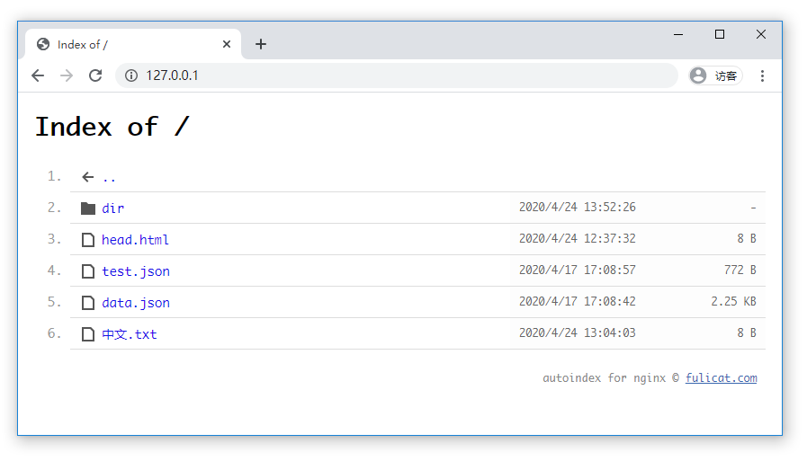

# nginx.autoindex 目录索引
autoindex for nginx

[download](https://github.com/fulicat/nginx.autoindex/releases)

###### config:

```nginx
    server {
        listen       80;
        server_name  localhost;
    
        # autoindex
        include nginx.autoindex.conf;
    
        location / {
            root   html;
            index  index.html index.htm;
        }
    }
```


###### screenshots:

